# PHASE 1: AWS CLOUD ARCHITECTURE
## Smart Wholesale Cloud Platform (ERP + CRM + WMS)

---

## 1. ARCHITECTURE OVERVIEW

```mermaid
graph TB
    subgraph "Internet"
        Users["👥 Users/Clients"]
        Mobile["📱 Mobile Apps"]
    end

    subgraph "AWS Region - Public Layer"
        Route53["🌐 Route 53<br/>(DNS)"]
        ACM["🔐 ACM<br/>(SSL Certificates)"]
        CloudFront["⚡ CloudFront<br/>(CDN)"]
    end

    subgraph "AWS Region - Edge Protection"
        WAF["🛡️ AWS WAF<br/>(Web Application Firewall)"]
    end

    subgraph "AWS Region - Load Balancing & VPC"
        ALB["⚙️ Application Load Balancer<br/>(Public Subnet AZ-1 & AZ-2)"]
        
        subgraph "VPC: 10.0.0.0/16"
            subgraph "Public Subnets (for NAT & ALB)"
                PubSub1["📍 Public Subnet AZ-1<br/>(10.0.1.0/24)"]
                PubSub2["📍 Public Subnet AZ-2<br/>(10.0.2.0/24)"]
                IGW["🚪 Internet Gateway"]
                NAT1["🔀 NAT Gateway AZ-1"]
                NAT2["🔀 NAT Gateway AZ-2"]
            end

            subgraph "Private Subnets (for Apps)"
                PrivSub1["🔒 Private Subnet AZ-1<br/>(10.0.10.0/24)"]
                PrivSub2["🔒 Private Subnet AZ-2<br/>(10.0.11.0/24)"]
                
                subgraph "Auto Scaling Group - App Tier"
                    EC2_1["💻 EC2 Instance AZ-1<br/>(Django + Gunicorn)"]
                    EC2_2["💻 EC2 Instance AZ-2<br/>(Django + Gunicorn)"]
                end
            end

            subgraph "Database Subnets (Private)"
                DbSub1["🗄️ DB Subnet AZ-1<br/>(10.0.20.0/24)"]
                DbSub2["🗄️ DB Subnet AZ-2<br/>(10.0.21.0/24)"]
                
                subgraph "RDS Multi-AZ"
                    RDS_Primary["🗄️ RDS PostgreSQL Primary<br/>(AZ-1)"]
                    RDS_Standby["🗄️ RDS PostgreSQL Standby<br/>(AZ-2) - Automatic Failover"]
                end
            end

            subgraph "Cache Subnet (Private)"
                CacheSub["💾 ElastiCache Subnet<br/>(10.0.30.0/24)"]
                Redis["⚡ ElastiCache Redis<br/>(Distributed Cache)"]
            end

            subgraph "Security"
                SGPublic["🔐 SG: ALB<br/>(Ingress: 80, 443 from 0.0.0.0)"]
                SGApp["🔐 SG: App Tier<br/>(Ingress: 8000 from ALB only)"]
                SGDatabase["🔐 SG: Database<br/>(Ingress: 5432 from App SG only)"]
                SGCache["🔐 SG: Cache<br/>(Ingress: 6379 from App SG only)"]
            end
        end
    end

    subgraph "AWS Region - Storage & Backup"
        S3["🪣 S3 Bucket<br/>(Product Images, Docs)"]
        Backup["💿 RDS Automated Backups<br/>(7-day retention)"]
    end

    subgraph "AWS Region - Monitoring & Security"
        CloudWatch["📊 CloudWatch<br/>(Logs, Metrics, Alarms)"]
        SecretsManager["🔑 Secrets Manager<br/>(DB Passwords, API Keys)"]
        IAMRole["👤 IAM Roles<br/>(Least Privilege Access)"]
    end

    subgraph "CI/CD Pipeline"
        GitHub["🐙 GitHub Repository"]
        GHActions["⚙️ GitHub Actions<br/>(Test, Build)"]
        ECR["📦 AWS ECR<br/>(Docker Registry)"]
        CodeDeploy["🚀 CodeDeploy<br/>(Deployment Automation)"]
    end

    %% Connections
    Users -->|HTTPS| Route53
    Mobile -->|HTTPS| Route53
    Route53 -->|Resolves to| ALB
    Route53 -->|Resolves to| CloudFront
    CloudFront -->|Pulls Static Assets| S3
    
    ACM -->|Provides SSL| ALB
    WAF -->|Protects| ALB
    
    ALB -->|Routes Traffic| EC2_1
    ALB -->|Routes Traffic| EC2_2
    
    PubSub1 -->|Houses| NAT1
    PubSub2 -->|Houses| NAT2
    PubSub1 -->|Houses| IGW
    
    IGW -->|Internet Access| ALB
    NAT1 -->|Outbound Access| PrivSub1
    NAT2 -->|Outbound Access| PrivSub2
    
    PrivSub1 -->|Houses| EC2_1
    PrivSub2 -->|Houses| EC2_2
    
    EC2_1 -->|Queries| RDS_Primary
    EC2_2 -->|Queries| RDS_Primary
    
    RDS_Primary -->|Replicates to| RDS_Standby
    
    EC2_1 -->|Caches| Redis
    EC2_2 -->|Caches| Redis
    
    EC2_1 -->|Uploads| S3
    EC2_2 -->|Uploads| S3
    
    EC2_1 -->|Logs to| CloudWatch
    EC2_2 -->|Logs to| CloudWatch
    
    RDS_Primary -->|Backed up to| Backup
    
    SecretsManager -->|Provides Secrets| EC2_1
    SecretsManager -->|Provides Secrets| EC2_2
    
    SGPublic -->|Secures| ALB
    SGApp -->|Secures| EC2_1
    SGApp -->|Secures| EC2_2
    SGDatabase -->|Secures| RDS_Primary
    SGDatabase -->|Secures| RDS_Standby
    SGCache -->|Secures| Redis
    
    GitHub -->|Triggers on Push| GHActions
    GHActions -->|Builds Docker Image| ECR
    ECR -->|Pulls Image| CodeDeploy
    CodeDeploy -->|Deploys to| EC2_1
    CodeDeploy -->|Deploys to| EC2_2
    
    IAMRole -->|Grants Permissions| EC2_1
    IAMRole -->|Grants Permissions| EC2_2
    IAMRole -->|Grants Permissions| CodeDeploy

    style Users fill:#e1f5ff
    style Mobile fill:#e1f5ff
    style Route53 fill:#fff3e0
    style ACM fill:#f3e5f5
    style CloudFront fill:#fff3e0
    style WAF fill:#ffebee
    style ALB fill:#f3e5f5
    style VPC fill:#e8f5e9
    style IGW fill:#fff9c4
    style NAT1 fill:#fff9c4
    style NAT2 fill:#fff9c4
    style EC2_1 fill:#e0f2f1
    style EC2_2 fill:#e0f2f1
    style RDS_Primary fill:#fce4ec
    style RDS_Standby fill:#fce4ec
    style Redis fill:#fff3cd
    style S3 fill:#e3f2fd
    style Backup fill:#f1f8e9
    style CloudWatch fill:#ede7f6
    style SecretsManager fill:#ffebee
    style IAMRole fill:#fbe9e7
    style GitHub fill:#e8eaf6
    style GHActions fill:#e8eaf6
    style ECR fill:#f3e5f5
    style CodeDeploy fill:#c8e6c9
```



---

## 2. COMPONENT BREAKDOWN

### 2.1 DNS & DOMAIN (Route 53)
**Why?**
- Global DNS service with high availability
- Integrated health checks for failover
- Supports weighted routing, geolocation routing
- Easy integration with ACM for SSL certificates

**Configuration:**
- Alias record pointing to ALB
- Health checks on ALB (HTTP 200 status)
- TTL: 300 seconds (5 minutes) for faster updates

---

### 2.2 SSL/TLS CERTIFICATES (AWS Certificate Manager)
**Why?**
- Free SSL certificates
- Auto-renewal (before expiration)
- Integrated with ALB and CloudFront
- No manual certificate management

**Configuration:**
- Certificate for: `*.yourdomain.com` + `yourdomain.com`
- Validation: DNS (automated renewal)

---

### 2.3 CONTENT DELIVERY NETWORK (CloudFront)
**Why?**
- Cache static assets globally (images, CSS, JS)
- Reduces load on ALB and EC2
- DDoS protection via AWS Shield
- Low latency for global users

**Configuration:**
- Origin: S3 bucket (for static assets)
- Origin: ALB (for dynamic content)
- Cache TTL: 86400 seconds (1 day) for images
- Compression: Enabled (gzip, brotli)

---

### 2.4 WEB APPLICATION FIREWALL (AWS WAF)
**Why?**
- Protects against SQL injection, XSS, DDoS attacks
- Rate limiting (prevents brute force)
- IP reputation lists
- Cost-effective security layer

**Configuration:**
- Rule: IP Rate Limiting (2000 requests per 5 minutes)
- Rule: AWS Managed Rules for SQL Injection & XSS
- Rule: Geo-blocking (if needed for compliance)

---

### 2.5 VIRTUAL PRIVATE CLOUD (VPC)
**Why?**
- Isolated network environment
- Multi-AZ deployment for high availability
- Control over IP ranges, subnets, routing
- Compliance with security best practices

**Configuration:**
- CIDR Block: `10.0.0.0/16` (65,536 IPs)
- Public Subnets (AZ-1, AZ-2): `10.0.1.0/24`, `10.0.2.0/24`
- Private Subnets (AZ-1, AZ-2): `10.0.10.0/24`, `10.0.11.0/24`
- Database Subnets (AZ-1, AZ-2): `10.0.20.0/24`, `10.0.21.0/24`
- Cache Subnet: `10.0.30.0/24`

---

### 2.6 INTERNET GATEWAY & NAT GATEWAYS
**Why?**
- **Internet Gateway**: Allows public subnets to access internet
- **NAT Gateways**: Allows private subnets to initiate outbound connections (for updates, external APIs)
- One NAT Gateway per AZ for high availability

**Configuration:**
- IGW: Attached to VPC
- NAT Gateway 1: In Public Subnet AZ-1
- NAT Gateway 2: In Public Subnet AZ-2
- Elastic IPs: Static public IPs for each NAT Gateway

---

### 2.7 APPLICATION LOAD BALANCER (ALB)
**Why?**
- Layer 7 (Application) routing (HTTP/HTTPS)
- Path-based & hostname-based routing
- Health checks for target groups
- Sticky sessions for Django session affinity
- Auto-scaling target integration

**Configuration:**
- Placement: Public Subnets (AZ-1, AZ-2)
- Listeners: HTTP (redirect to HTTPS), HTTPS (443)
- Target Group: EC2 instances (port 8000 - Gunicorn)
- Health Check: `/health/` endpoint (every 30 sec)
- Idle Timeout: 60 seconds

---

### 2.8 EC2 AUTO SCALING GROUP
**Why?**
- Automatically scales instances based on demand
- Distributes traffic across multiple AZs
- Self-healing (replaces failed instances)
- Cost optimization (scales down during low traffic)

**Configuration:**
- Launch Template: Custom AMI with Django + Gunicorn
- Min Instances: 2 (one per AZ)
- Max Instances: 6 (scaling based on demand)
- Desired Capacity: 2 (initial)
- Scaling Policies:
  - **Scale-Up**: CPU > 70% for 2 minutes → Add 1 instance
  - **Scale-Down**: CPU < 30% for 5 minutes → Remove 1 instance
- Health Check Type: ELB (ALB)
- Termination Policy: Default (oldest instance first)

**Instance Configuration:**
- Instance Type: `t3.medium` (burstable, cost-effective)
  - 2 vCPU, 4 GB RAM
  - For heavy workloads: `t3.large` or `m6i.large`
- OS: Amazon Linux 2 or Ubuntu 22.04 LTS
- IAM Instance Profile: EC2InstanceRole (for AWS services access)

---

### 2.9 RELATIONAL DATABASE SERVICE (RDS PostgreSQL)
**Why?**
- Managed PostgreSQL 16 (automatic patching, backups)
- Multi-AZ deployment (automatic failover)
- Read replicas for scaling read-heavy workloads
- Automated backups and point-in-time recovery

**Configuration:**
- **Database Engine**: PostgreSQL 16
- **Instance Class**: `db.t3.small` (initial)
  - For production: `db.m6i.large` or higher
- **Multi-AZ**: Enabled (Standby in AZ-2)
- **Backup Retention**: 7 days (14 days for production)
- **Backup Window**: 03:00-04:00 UTC (off-peak)
- **Maintenance Window**: Sunday 04:00-05:00 UTC
- **Storage**: 100 GB (io1 with 1000 IOPS for production)
- **Auto-scaling**: Enabled (up to 300 GB)
- **Encryption**: AWS KMS (at rest)
- **Security**: Encrypted connections (SSL/TLS)
- **Parameter Group**: Custom (optimize for Django)
  - `max_connections = 200`
  - `shared_buffers = 256MB`
  - `work_mem = 4MB`
- **Option Group**: Default

**Read Replicas** (future scaling):
- Create in different AZ or region (for DR)
- Endpoint: Load-balance read queries

---

### 2.10 ELASTICACHE (Redis)
**Why?**
- Distributed in-memory cache
- Reduce database load
- Session storage (Django sessions)
- Task queue (Celery)
- Real-time data (leaderboards, counters)

**Configuration:**
- **Engine**: Redis (Latest version)
- **Node Type**: `cache.t3.small` (for development)
  - For production: `cache.r6i.large` or larger
- **Number of Nodes**: 2 (primary + replica for automatic failover)
- **Automatic Failover**: Enabled
- **Multi-AZ**: Enabled (automatic failover between AZs)
- **Encryption**: Enabled (in-transit and at-rest)
- **Auth Token**: Generated (password protection)
- **Subnet Group**: Private subnets
- **Parameter Group**: Default (optimize as needed)

---

### 2.11 S3 BUCKET (Storage)
**Why?**
- Object storage for images, documents, backups
- Infinite scalability
- Versioning and lifecycle policies
- Cost-effective for infrequent access (Glacier)

**Configuration:**
- **Bucket Name**: `wholesale-platform-{environment}-{uuid}`
- **Region**: Same as primary RDS
- **Public Access**: Block all public access
- **Versioning**: Enabled
- **Server-side Encryption**: AWS KMS
- **Lifecycle Policy**:
  - Move to STANDARD_IA after 30 days
  - Move to GLACIER after 90 days
  - Delete after 365 days
- **CORS**: Allow requests from CloudFront & ALB
- **Backup**: Enable cross-region replication (for DR)

---

### 2.12 SECURITY GROUPS (Firewall Rules)
**Why?**
- Least privilege access (only required ports open)
- Stateful firewall (tracks connections)
- Layer between components

**Configuration:**

#### **ALB Security Group**
```
Ingress:
- Protocol: TCP, Port: 80 (HTTP), Source: 0.0.0.0/0
- Protocol: TCP, Port: 443 (HTTPS), Source: 0.0.0.0/0

Egress:
- All traffic allowed (default)
```

#### **App Tier Security Group**
```
Ingress:
- Protocol: TCP, Port: 8000 (Gunicorn), Source: ALB SG
- Protocol: TCP, Port: 22 (SSH), Source: VPN/Bastion CIDR (not 0.0.0.0/0)

Egress:
- All traffic allowed (for external API calls, package updates)
```

#### **Database Security Group**
```
Ingress:
- Protocol: TCP, Port: 5432 (PostgreSQL), Source: App Tier SG
- (No SSH access - use RDS Enhanced Monitoring)

Egress:
- None (database doesn't initiate outbound connections)
```

#### **Cache Security Group**
```
Ingress:
- Protocol: TCP, Port: 6379 (Redis), Source: App Tier SG

Egress:
- None (cache doesn't initiate outbound connections)
```

---

### 2.13 SECRETS MANAGER
**Why?**
- Centralized secret management
- Automatic rotation
- Audit trail (CloudTrail)
- Prevents secrets in code/environment variables

**Configuration:**
- **Secrets to Store**:
  - `db/master-password` (RDS master password)
  - `django/secret-key`
  - `django/api-keys` (external services)
  - `aws/s3-access-keys` (if using IAM is not possible)
- **Rotation**: Automatic (every 30 days)
- **Encryption**: AWS KMS

---

### 2.14 CLOUDWATCH (Monitoring & Logging)
**Why?**
- Centralized logging for all services
- Metrics for performance monitoring
- Alarms for automatic responses
- Dashboards for visualization

**Configuration:**
- **Log Groups**:
  - `/aws/ec2/django-app` (application logs)
  - `/aws/rds/postgresql` (database logs)
  - `/aws/alb/access-logs` (load balancer access logs)
- **Metrics**:
  - CPU Utilization (EC2, RDS)
  - Memory Utilization (EC2)
  - Database Connections (RDS)
  - Disk Space (RDS)
  - Cache Hit Ratio (ElastiCache)
  - ALB Response Time
- **Alarms**:
  - High CPU (> 80%) → Send SNS notification
  - High Memory (> 85%) → Scale up
  - Database Disk (> 80%) → Alert
  - ALB Unhealthy Hosts → Alert
  - Failed Deployments → Alert

---

### 2.15 IAM ROLES & POLICIES (Least Privilege)
**Why?**
- EC2 instances can access AWS services without hardcoded credentials
- Audit trail of who did what
- Compliance with least privilege principle

**Configuration:**

#### **EC2 Instance Role**
```json
{
  "Version": "2012-10-17",
  "Statement": [
    {
      "Effect": "Allow",
      "Action": [
        "s3:PutObject",
        "s3:GetObject",
        "s3:DeleteObject"
      ],
      "Resource": "arn:aws:s3:::wholesale-platform-*/*"
    },
    {
      "Effect": "Allow",
      "Action": [
        "secretsmanager:GetSecretValue"
      ],
      "Resource": "arn:aws:secretsmanager:region:account:secret:*"
    },
    {
      "Effect": "Allow",
      "Action": [
        "logs:CreateLogGroup",
        "logs:CreateLogStream",
        "logs:PutLogEvents"
      ],
      "Resource": "arn:aws:logs:region:account:*"
    },
    {
      "Effect": "Allow",
      "Action": [
        "cloudwatch:PutMetricData"
      ],
      "Resource": "*"
    }
  ]
}
```

#### **CodeDeploy Role**
```json
{
  "Effect": "Allow",
  "Action": [
    "ec2:*",
    "autoscaling:*",
    "elasticloadbalancing:*",
    "s3:GetObject",
    "ecr:GetDownloadUrlForLayer",
    "ecr:BatchGetImage"
  ],
  "Resource": "*"
}
```

---

## 3. HIGH AVAILABILITY & DISASTER RECOVERY

### **High Availability (HA)**
| Component | HA Strategy | RTO | RPO |
|-----------|-------------|-----|-----|
| EC2 | Multi-AZ ASG | 1-2 min | ~30 sec |
| RDS | Multi-AZ with automatic failover | 1-2 min | <1 min |
| ElastiCache | Multi-AZ with automatic failover | 1-2 min | <1 min |
| ALB | Multi-AZ (default) | 1 min | <30 sec |

### **Disaster Recovery (DR)**
| Component | Backup Strategy | Retention | Restore Time |
|-----------|-----------------|-----------|--------------|
| RDS Database | Automated snapshots | 7 days | 5-15 min |
| S3 Data | Cross-region replication | Unlimited | 5-10 min |
| EBS Volumes | Snapshots (daily) | 30 days | 5-10 min |
| Code | GitHub (version control) | Unlimited | Immediate |

**RTO (Recovery Time Objective)**: Maximum acceptable downtime
**RPO (Recovery Point Objective)**: Maximum acceptable data loss

---

## 4. SECURITY BEST PRACTICES

### **Network Security**
- ✅ VPC isolation (no public database/cache)
- ✅ Security groups with least privilege
- ✅ VPN/Bastion host for SSH access
- ✅ NACLs for subnet-level filtering (if needed)

### **Data Security**
- ✅ Encryption at rest (RDS, S3, EBS)
- ✅ Encryption in transit (TLS/SSL everywhere)
- ✅ Secrets Manager for credential management
- ✅ AWS KMS for key management

### **Access Control**
- ✅ IAM roles (no hardcoded credentials)
- ✅ Multi-factor authentication (MFA)
- ✅ Service-to-service authentication
- ✅ Audit logging (CloudTrail, VPC Flow Logs)

### **Application Security**
- ✅ WAF for web application attacks
- ✅ DDoS protection (AWS Shield Standard - free)
- ✅ Security headers (HSTS, CSP, X-Frame-Options)
- ✅ Rate limiting on ALB & API Gateway

### **Operational Security**
- ✅ CloudWatch alarms for suspicious activity
- ✅ VPC Flow Logs for network monitoring
- ✅ RDS audit logging
- ✅ S3 access logging

---

## 5. SCALABILITY STRATEGY

### **Horizontal Scaling (Scale-Out)**
- **EC2 Auto Scaling Group**: Automatically add/remove instances
- **RDS Read Replicas**: Handle read-heavy workloads
- **ElastiCache Cluster**: Distribute cache across multiple nodes

### **Vertical Scaling (Scale-Up)**
- **RDS**: Upgrade instance class (t3.small → m6i.large)
- **EC2**: Upgrade instance type (t3.medium → t3.large)
- **ElastiCache**: Upgrade node type

### **Database Optimization**
- ✅ Connection pooling (PgBouncer, Pgpool)
- ✅ Query optimization & indexing
- ✅ Materialized views for complex queries
- ✅ Read replicas for reporting/analytics

### **Application Optimization**
- ✅ Caching (Redis for sessions, data)
- ✅ Async tasks (Celery + Redis)
- ✅ CDN for static assets (CloudFront)
- ✅ Lazy loading & pagination

---

## 6. COST OPTIMIZATION

| Component | Estimated Monthly Cost | Optimization |
|-----------|----------------------|--------------|
| EC2 (2x t3.medium) | $30-50 | Use reserved instances, spot instances |
| RDS (db.t3.small) | $40-60 | Use burstable instances, storage optimization |
| ElastiCache (cache.t3.small) | $25-35 | Use reserved nodes |
| ALB | $15-20 | Fixed cost, minimal optimization |
| Data Transfer | $10-20 | CloudFront caching, optimize API calls |
| Storage (S3) | $5-10 | Lifecycle policies, compression |
| **Total** | **~$125-195/month** | **Apply all optimizations** |

**Cost Reduction Ideas:**
1. Use **Reserved Instances** (30-40% discount for 1-year commitment)
2. Use **Spot Instances** for non-critical workloads (70% discount)
3. Right-size instances (monitor CloudWatch metrics)
4. Enable **auto-scaling** (scale down during off-peak)
5. Use **S3 Intelligent-Tiering** (automatic cost optimization)
6. Consolidate logs & metrics (avoid duplicate storage)

---

## 7. MONITORING & ALERTING

### **Key Metrics to Monitor**
```
Application Level:
- Request count, latency, error rate
- Concurrent users
- API response time

Infrastructure Level:
- EC2 CPU, Memory, Disk I/O
- RDS CPU, Memory, Connections, Replication Lag
- ElastiCache Hit Rate, Evictions
- ALB Health, Target Group Status

Business Level:
- User registration rate
- Order processing rate
- Revenue per day
```

### **CloudWatch Dashboards**
Create custom dashboards for:
1. **Operations Dashboard** (system health)
2. **Business Dashboard** (KPIs)
3. **Performance Dashboard** (response times, latencies)
4. **Security Dashboard** (WAF blocks, unauthorized access)

---

## 8. NETWORK TOPOLOGY & ROUTING

### **Route Table: Public Subnets**
```
Destination       | Target
0.0.0.0/0        | Internet Gateway (IGW)
10.0.0.0/16      | Local VPC (direct routing)
```

### **Route Table: Private Subnets (App Tier)**
```
Destination       | Target
0.0.0.0/0        | NAT Gateway (AZ-specific)
10.0.0.0/16      | Local VPC (direct routing)
```

### **Route Table: Database Subnets**
```
Destination       | Target
10.0.0.0/16      | Local VPC (direct routing)
```

---

## 9. FUTURE ENHANCEMENTS

| Feature | Benefit | Implementation |
|---------|---------|-----------------|
| **AWS WAF Advanced Rules** | Prevent advanced attacks | Custom rule creation |
| **VPC Endpoints** | Private access to AWS services | Gateway/Interface endpoints |
| **CloudTrail** | Audit logging for compliance | Enable logging to S3 |
| **Config** | Track resource changes | Config rules & compliance |
| **Lambda + API Gateway** | Serverless APIs | Offload non-critical APIs |
| **DynamoDB** | NoSQL for real-time data | High-frequency updates |
| **Kinesis** | Real-time analytics | Stream processing |
| **SageMaker** | ML for recommendations | Predictive analytics |
| **Backup Service** | Centralized backup management | Automated backup policies |
| **DataSync** | On-premises to S3 sync | Hybrid cloud setup |

---

## 10. SECURITY CHECKLIST

- [ ] VPC created with public & private subnets
- [ ] Internet Gateway & NAT Gateways configured
- [ ] Security groups with least privilege rules
- [ ] ALB with HTTPS only (HTTP → HTTPS redirect)
- [ ] RDS Multi-AZ enabled with encryption
- [ ] ElastiCache with encryption & auth token
- [ ] S3 with public access blocked & versioning enabled
- [ ] Secrets Manager configured with rotation
- [ ] CloudWatch alarms for critical metrics
- [ ] IAM roles with least privilege policies
- [ ] AWS WAF attached to ALB
- [ ] CloudTrail enabled for audit logging
- [ ] VPC Flow Logs enabled
- [ ] Route 53 health checks configured
- [ ] Backup & disaster recovery tested

---

## 11. DEPLOYMENT FLOW

```
┌─────────────────┐
│  Git Push (Dev) │
└────────┬────────┘
         │
         ▼
┌─────────────────────────────┐
│  GitHub Actions Triggered   │
│ (Test + Build Docker Image) │
└────────┬────────────────────┘
         │
         ▼
┌──────────────────┐
│  Tests Pass?     │
└────┬────────┬────┘
     │ FAIL   │ PASS
     ▼        ▼
  STOP    ┌──────────────┐
          │ Push to ECR  │
          └────┬─────────┘
               │
               ▼
       ┌──────────────────┐
       │ Create New AMI   │
       │ with Docker Img  │
       └────┬─────────────┘
            │
            ▼
    ┌──────────────────┐
    │ Update ASG       │
    │ Launch Template  │
    └────┬─────────────┘
         │
         ▼
    ┌──────────────────┐
    │ Gradually Replace│
    │ EC2 Instances    │
    │ (Blue-Green)     │
    └──────────────────┘
```

---

## SUMMARY

This architecture provides:
- ✅ **High Availability** (99.9% uptime SLA)
- ✅ **Scalability** (auto-scaling, CDN caching)
- ✅ **Security** (encryption, least privilege, WAF)
- ✅ **Cost-Effective** (~$125-195/month for startup)
- ✅ **Maintainability** (managed services, automation)
- ✅ **Compliance** (encryption, audit logging)

---

## NEXT STEPS (After Approval)

Once you approve this architecture, we'll proceed to **PHASE 2: DJANGO APPLICATION** where we'll build:
- Complete Django project structure
- Database models for ERP/CRM/WMS
- Django REST Framework APIs
- Custom authentication (JWT)
- Admin customization

---

**Phase 1 Complete! ✅**
Ready for your review and approval before proceeding to Phase 2.
